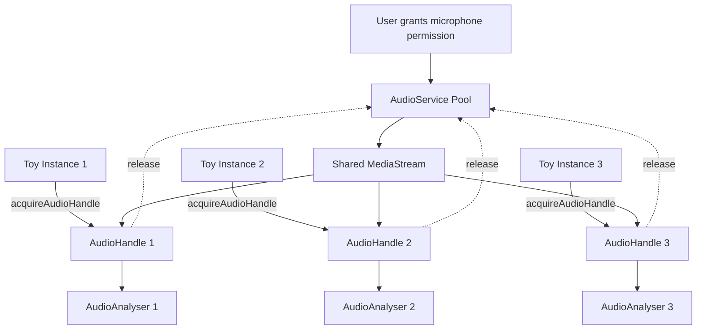
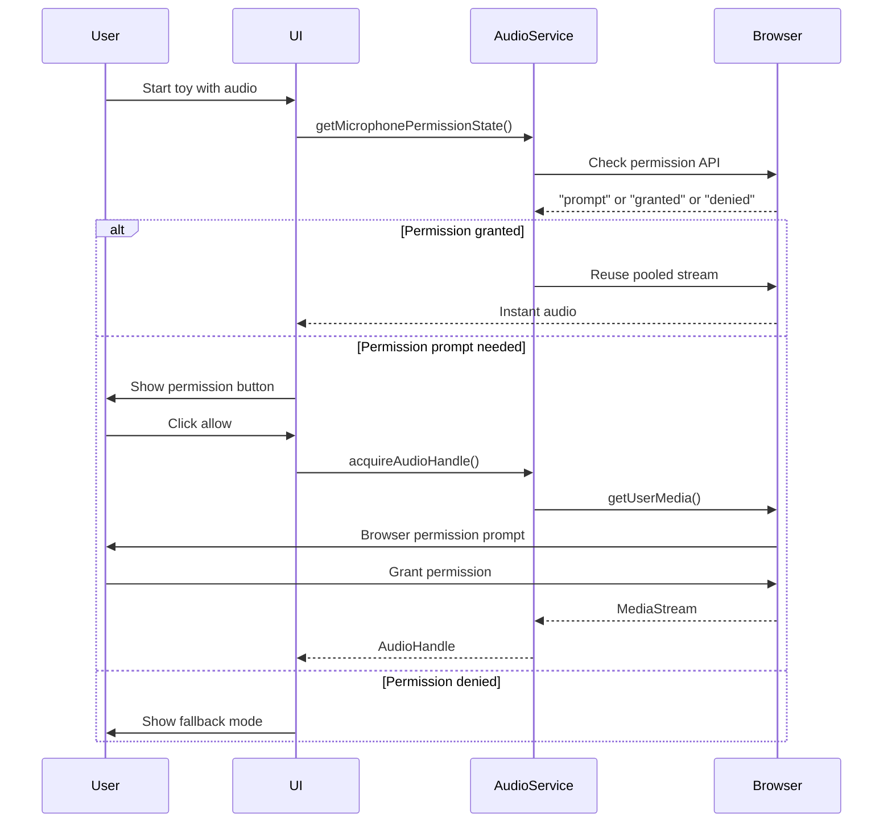

The Stims audio system provides pooled microphone access and audio analysis for reactive visualizations. It minimizes permission prompts and stream allocations by reusing a single `MediaStream` across multiple toys.

## Audio Architecture

The audio system is built around the concept of **pooled microphone access** where a single microphone stream is shared across multiple toy instances:



## Audio Handle Interface

The audio service provides an `AudioHandle` that includes all resources needed for audio-reactive toys:

```typescript
export type AudioHandle = {
  analyser: FrequencyAnalyser;
  listener: THREE.AudioListener;
  audio: THREE.Audio | THREE.PositionalAudio;
  stream?: MediaStream;
  release: () => void;
};
```

### AudioHandle Components

<Expandable title="analyser - Frequency Analysis">
  A `FrequencyAnalyser` instance that provides real-time frequency data and audio features:
  
  ```typescript
  const freqData = audioHandle.analyser.getFrequencyData();
  const bass = audioHandle.analyser.getBass();
  const treble = audioHandle.analyser.getTreble();
  ```
</Expandable>

<Expandable title="listener - Three.js Audio Listener">
  A Three.js `AudioListener` typically attached to the camera for spatial audio support.
</Expandable>

<Expandable title="audio - Three.js Audio Object">
  A `THREE.Audio` or `THREE.PositionalAudio` object connected to the microphone stream.
</Expandable>

<Expandable title="stream - MediaStream (optional)">
  The underlying browser `MediaStream` from `getUserMedia()`. Only exposed when `reuseMicrophone` is disabled.
</Expandable>

<Expandable title="release() - Cleanup Function">
  Releases the audio resources back to the pool. **Must be called** when the toy is disposed to prevent memory leaks.
</Expandable>

## Acquiring Audio

Use `acquireAudioHandle()` to get audio resources for your toy:

```typescript
import { acquireAudioHandle } from './services/audio-service';

export async function start(options?: ToyStartOptions): Promise<ToyInstance> {
  // Request audio with default settings (pooled microphone)
  const audioHandle = await acquireAudioHandle();
  
  // Use the analyser in your animation loop
  function animate() {
    const freqData = audioHandle.analyser.getFrequencyData();
    // Update visualization based on audio...
  }
  
  return {
    dispose() {
      // Always release audio handle
      audioHandle.release();
    },
  };
}
```

### Audio Init Options

```typescript
export interface AudioInitOptions {
  /**
   * Reuse the pooled microphone stream (default: true)
   */
  reuseMicrophone?: boolean;
  
  /**
   * MediaStream constraints for getUserMedia()
   */
  constraints?: MediaStreamConstraints;
  
  /**
   * Existing stream to use instead of requesting a new one
   */
  stream?: MediaStream;
  
  /**
   * Custom initAudio implementation for testing
   */
  initAudioImpl?: typeof initAudio;
  
  /**
   * Stop the stream when release() is called (default: false with pooling)
   */
  teardownOnRelease?: boolean;
}
```

## Microphone Pooling

The audio service maintains a global pool to avoid repeated permission prompts:

```typescript
type AudioPoolEntry = {
  stream: MediaStream;
  users: number;
};

let pooledStream: AudioPoolEntry | null = null;
let streamPromise: Promise<MediaStream | null> | null = null;
```

### Pool Lifecycle

1. **First acquisition**: Prompts user for microphone permission via `getUserMedia()`
2. **Subsequent acquisitions**: Reuses the same stream, incrementing the user count
3. **Release**: Decrements the user count; stream remains active for next toy
4. **Reset**: Optionally stops all tracks when navigating back to library

<Info>
  By default, the microphone stream stays active even when no toys are using it. This provides instant audio when loading the next toy, but you can call `resetAudioPool({ stopStreams: true })` to fully stop it.
</Info>

## Stream Management

The audio service provides several functions for managing the stream lifecycle:

### getOrCreateStream()

```typescript
async function getOrCreateStream(constraints?: MediaStreamConstraints) {
  if (pooledStream?.stream) return pooledStream.stream;
  if (streamPromise) return streamPromise;

  streamPromise = navigator.mediaDevices
    ?.getUserMedia(constraints ?? DEFAULT_MICROPHONE_CONSTRAINTS)
    .catch((error) => {
      streamPromise = null;
      throw error;
    });

  const stream = await streamPromise;
  if (!stream) return null;

  pooledStream = { stream, users: 0 };
  return stream;
}
```

Ensures only one `getUserMedia()` call is active at a time, preventing race conditions.

### prewarmMicrophone()

```typescript
export async function prewarmMicrophone(
  constraints?: MediaStreamConstraints
): Promise<PermissionState> {
  const permission = await getMicrophonePermissionState();
  if (permission !== 'granted') return permission;

  await getOrCreateStream(constraints);
  return permission;
}
```

Preloads the microphone stream before a toy starts. Use this during app initialization to hide microphone latency:

```typescript
// In app.ts bootstrap
await prewarmMicrophone();
```

### resetAudioPool()

```typescript
export async function resetAudioPool({ stopStreams = true } = {}) {
  if (stopStreams) {
    stopPooledStream();
    return;
  }

  pooledStream = null;
  streamPromise = null;
}
```

Resets the audio pool state. Call with `stopStreams: true` to fully stop microphone tracks (e.g., when navigating to the library).

## Audio Handle Lifecycle

The `acquireAudioHandle()` function manages the complete lifecycle:

```typescript
export async function acquireAudioHandle(
  options: AudioInitOptions = {},
): Promise<AudioHandle> {
  const {
    reuseMicrophone = true,
    initAudioImpl = initAudio,
    teardownOnRelease = false,
    ...audioOptions
  } = options;

  let stream: MediaStream | null = audioOptions.stream ?? null;
  let pooledEntry: AudioPoolEntry | null = null;

  // Get or reuse stream
  if (reuseMicrophone && !stream) {
    stream = await getOrCreateStream(audioOptions.constraints);
    if (stream && pooledStream) {
      pooledStream.users += 1;
      pooledEntry = pooledStream;
    }
  }

  // Initialize audio components
  let audio: Awaited<ReturnType<typeof initAudioImpl>>;
  try {
    audio = await initAudioImpl({
      ...audioOptions,
      stream: stream ?? audioOptions.stream,
      stopStreamOnCleanup: !reuseMicrophone,
    });
  } catch (error) {
    // Rollback pool user count on error
    if (pooledEntry) {
      pooledEntry.users = Math.max(0, pooledEntry.users - 1);
      if (pooledEntry.users === 0) {
        stopPooledStream();
      }
    }
    throw error;
  }

  // Create release function
  const release = () => {
    audio.cleanup?.();

    if (reuseMicrophone && pooledStream && stream === pooledStream.stream) {
      pooledStream.users = Math.max(0, pooledStream.users - 1);

      if (pooledStream.users === 0 && teardownOnRelease) {
        stopPooledStream();
      }
    }
  };

  return {
    analyser: audio.analyser,
    listener: audio.listener,
    audio: audio.audio,
    stream: audio.stream,
    release,
  };
}
```

### Error Handling

<Warning>
  If audio initialization fails after acquiring a pooled stream, the user count is automatically rolled back to prevent pool corruption.
</Warning>

## Microphone Permission Flow

The audio system integrates with the UI permission flow:



## Usage Patterns

### Standard Audio-Reactive Toy

```typescript
import { acquireAudioHandle } from '../core/services/audio-service';
import type { ToyInstance, ToyStartOptions } from '../core/toy-interface';

export async function start(options?: ToyStartOptions): Promise<ToyInstance> {
  // Get pooled audio
  const audioHandle = await acquireAudioHandle();
  
  // Set up scene with audio listener
  const camera = new THREE.PerspectiveCamera();
  camera.add(audioHandle.listener);
  
  function animate() {
    const analyser = audioHandle.analyser;
    
    // Get frequency bins
    const freqData = analyser.getFrequencyData();
    
    // Or use convenience methods
    const bass = analyser.getBass();
    const mid = analyser.getMid();
    const treble = analyser.getTreble();
    
    // Update visualization...
  }
  
  return {
    dispose() {
      audioHandle.release();
    },
  };
}
```

### Custom Stream (No Pooling)

```typescript
// For specialized audio toys that need their own stream
const audioHandle = await acquireAudioHandle({
  reuseMicrophone: false,
  teardownOnRelease: true,
  constraints: {
    audio: {
      echoCancellation: false,
      noiseSuppression: false,
      autoGainControl: false,
    },
  },
});
```

### Prewarming for Instant Start

```typescript
// In loader or app bootstrap
import { prewarmMicrophone } from '../core/services/audio-service';

// Before loading an audio toy
const permission = await prewarmMicrophone();

if (permission === 'granted') {
  // Stream is ready, toy will start instantly
  await loadToy(slug);
} else {
  // Show permission UI
  showMicrophonePrompt();
}
```

## Audio Service Integration Points

| Module | Purpose | Integration |
|--------|---------|-------------|
| `microphone-flow.ts` | UI permission buttons | Wires buttons to `prewarmMicrophone()` and `acquireAudioHandle()` |
| `web-toy.ts` | Toy runtime helpers | Optionally requests audio via `acquireAudioHandle()` |
| `loader.ts` | Toy lifecycle | Calls `resetAudioPool({ stopStreams: true })` on navigate to library |
| `app.ts` | App bootstrap | Can call `prewarmMicrophone()` after capability preflight |

## Best Practices

<Info>
  **Always release audio handles** - Call `audioHandle.release()` in your toy's `dispose()` method to prevent memory leaks and pool corruption.
</Info>

<Warning>
  **Don't stop pooled streams manually** - Let the audio service manage stream lifecycle. Stopping a pooled stream will break other toys.
</Warning>

### Do's and Don'ts

✅ **Do:**
- Use default pooling (`reuseMicrophone: true`) for standard toys
- Call `release()` in your `dispose()` method
- Use `prewarmMicrophone()` to hide latency
- Check permission state before acquiring audio

❌ **Don't:**
- Manually call `stream.getTracks().forEach(t => t.stop())`
- Acquire multiple handles in the same toy without releasing
- Forget to release handles on disposal
- Bypass the audio service for microphone access

## Debugging Audio Issues

<Expandable title="No audio data in analyser">
  - Check that microphone permission is granted
  - Verify the stream has active audio tracks: `stream.getAudioTracks()[0].enabled`
  - Check browser console for `getUserMedia()` errors
  - Ensure the analyser is connected: `audioHandle.audio.isPlaying`
</Expandable>

<Expandable title="Multiple permission prompts">
  - Ensure you're using `reuseMicrophone: true` (default)
  - Check that previous toys called `release()`
  - Verify the pool isn't being reset between toys
</Expandable>

<Expandable title="Memory leaks">
  - Use Chrome DevTools Memory profiler to find unreleased handles
  - Ensure every `acquireAudioHandle()` has a matching `release()`
  - Check that animation loops are stopped before releasing
</Expandable>

## Next Steps

<CardGroup cols={2}>
  <Card title="Rendering" icon="brush" href="/architecture/rendering">
    Learn about renderer pooling and WebGL/WebGPU backend selection
  </Card>
  <Card title="Architecture Overview" icon="diagram-project" href="/architecture/overview">
    Return to the architecture overview
  </Card>
</CardGroup>