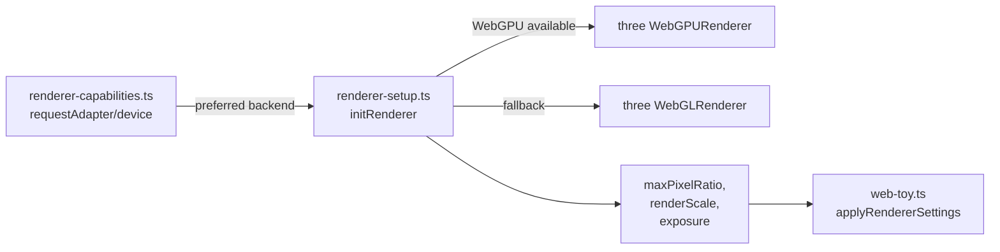
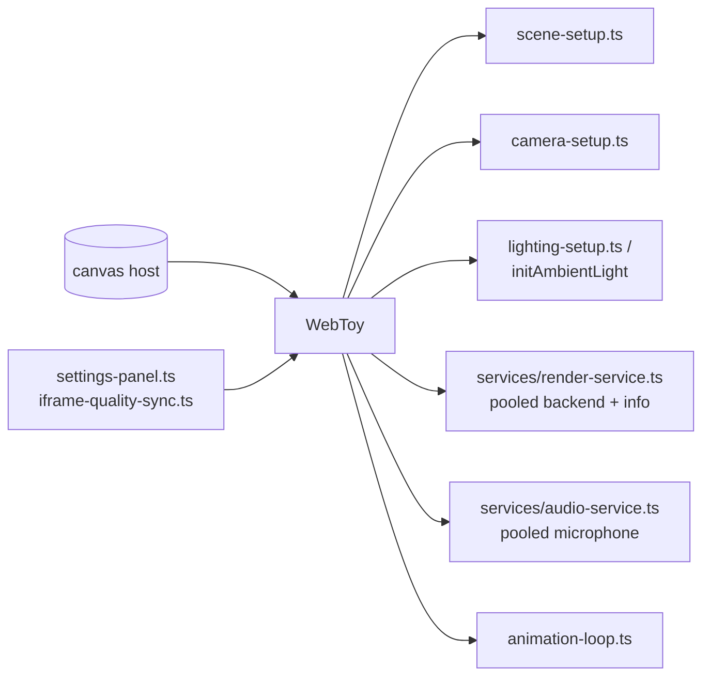

This document provides a comprehensive overview of how the Stims web toys application is assembled, from HTML entry points through module loading, rendering, audio, and quality controls.

## Architecture at a Glance

Stims follows a layered architecture that separates concerns between entry points, orchestration, views, runtime services, and toy implementations:

- **Entry shells** (`toy.html`, `toys/*.html`) are thin HTML pages that bootstrap `assets/js/app.ts`; toy shells pass a `toy=<slug>` query param, while `index.html` boots the library shell.
- **App + loader orchestration** (`assets/js/app.ts`, `assets/js/loader.ts`, `assets/js/router.ts`) owns page boot, capability preflight, navigation, lifecycle boundaries, and loader state.
- **View state** (`assets/js/toy-view.ts`, `assets/js/library-view.js`) renders the library, toy container, and status banners.
- **Runtime core** (`assets/js/core/*`) encapsulates rendering, audio, settings, and per-frame loop wiring.
- **Toy modules** (`assets/js/toys/*.ts`) provide toy-specific scenes and a cleanup hook (`dispose`) that the loader can call safely.

## Architecture Tiers

The architecture is divided into required and optional tiers:

### Tier 0: Site Runtime (Required)

HTML entry points, loader/router, views, runtime core, and toy modules. This tier is enough to run and deploy the web toy experience.

### Tier 1: Automation and External Transports (Optional)

MCP stdio/Worker transports and agent-oriented automation workflows. This tier is only needed when integrating MCP clients or agent tooling.

<Info>
  Keep Tier 0 reliable first, and treat Tier 1 as an add-on surface that can evolve independently.
</Info>

## Runtime Layers

The runtime is organized into the following layers:

| Layer | Files | Purpose |
|-------|-------|----------|
| **HTML entry points** | `index.html`, `toy.html`, `toys/*.html` | Load `assets/js/app.ts`; toy pages provide `?toy=<slug>` query params |
| **App bootstrap** | `assets/js/app.ts` | Detects library vs toy pages, wires controls, runs capability preflight, and starts loader flows |
| **Loader + routing** | `assets/js/loader.ts`, `assets/js/router.ts` | Coordinate navigation, history, active toy lifecycle, and dynamic module loading |
| **UI views** | `assets/js/toy-view.ts`, `assets/js/library-view.js` | Render the library grid, active toy container, loading/error states, and renderer status badges |
| **Manifest resolution** | `assets/js/utils/manifest-client.ts` | Maps logical module paths to the correct dev/build URLs for dynamic `import()` |
| **Core runtime** | `assets/js/core/*` | Initializes scene, camera, renderer (WebGPU or WebGL), audio pipeline, quality controls, and handles linting/formatting via Biome |
| **Shared services** | `assets/js/core/services/*` | Pool renderers and microphone streams so toys can hand off resources without re-allocating |
| **Toys** | `assets/js/toys/*.ts` | Compose the core primitives, export a `start` entry, and provide a cleanup hook (commonly via `dispose`) |

## App Shell and Loader Flow

The following diagram illustrates how the application boots and loads toys:

```mermaid
flowchart TD
  Entry[HTML shell
  index.html, toy.html, toys/*.html] --> App[app.ts
  startApp()]
  App --> Loader[loader.ts
  createLoader()]
  Loader --> Router[router.ts
  query param sync]
  App --> Preflight[capability-preflight.ts
  gate/start hints]
  App --> Controls[ui/audio-controls.ts
  ui/system-controls.ts]
  Loader --> Views[toy-view.ts /
  library-view.js]
  Loader --> Manifest[manifest-client.ts
  resolve module URL]
  Loader -->|import| ToyModule[assets/js/toys/<slug>.ts]
  ToyModule --> WebToy[core/web-toy.ts
  scene/camera/renderer/audio]
  WebToy --> Caps[renderer-capabilities.ts
  detect WebGPU/WebGL]
  WebToy --> Audio[microphone-flow.ts
  utils/audio-handler.ts]
  WebToy --> Settings[settings-panel.ts
  iframe-quality-sync.ts]
  Views -->|back/escape| Loader
  Preflight --> Loader
  Controls --> Loader
```

## Rendering and Capability Detection

The rendering system automatically detects and uses the best available graphics backend:



### Capability Detection Process

1. **Capability probe**: `renderer-capabilities.ts` caches the adapter/device decision and records fallback reasons so the UI can surface retry prompts
2. **Initialization**: `renderer-setup.ts` builds a renderer using the preferred backend, applies tone mapping, sets pixel ratio/size, and returns metadata
3. **Quality presets**: `settings-panel.ts` and `iframe-quality-sync.ts` broadcast max pixel ratio, render scale, and exposure
4. **Settings application**: `WebToy.updateRendererSettings` re-applies settings without a reload

<Info>
  WebGPU probing is feature-based (`navigator.gpu`) rather than user-agent gated, so supported mobile browsers can use WebGPU.
</Info>

## WebToy Composition



### Renderer Pooling

`services/render-service.ts` initializes WebGPU/WebGL once, applies the active quality preset from `settings-panel.ts`, and hands a typed handle to toys:

```typescript
type RendererHandle = {
  renderer: THREE.WebGLRenderer | WebGPURenderer;
  backend: RendererBackend;
  info: RendererInitResult;
  canvas: HTMLCanvasElement;
  applySettings: (
    options?: Partial<RendererInitConfig>,
    viewport?: RendererViewport,
  ) => void;
  release: () => void;
};
```

Returning the handle releases the canvas back into the pool without disposing the renderer, so switching toys avoids expensive re-creation.

## Runtime State and Data Flow

### Active Toy State

The loader owns the active toy reference and is responsible for calling `dispose`. The toy should only manage its own scene resources (geometries, materials, textures).

### Renderer State

Pooled renderers are configured by `renderer-settings.ts`. Toys can layer overrides via `handle.applySettings` but should not mutate shared renderer state permanently.

### Audio State

The audio service owns the shared `MediaStream`, while each toy owns its `AudioAnalyser` instance. Release the handle so the pool can reuse the stream.

### Settings Propagation

`settings-panel.ts` updates propagate to `web-toy.ts` through `iframe-quality-sync.ts`, keeping both the shell UI and toy renderer in sync.

## Troubleshooting Signals

<Expandable title="WebGPU unavailable">
  `renderer-capabilities.ts` writes a fallback reason and toggles `shouldRetryWebGPU`. The view surfaces a retry button that re-probes with `forceRetry`.
</Expandable>

<Expandable title="Import failures">
  The loader's `view.showImportError` shows the module URL and offers a back link.
</Expandable>

<Expandable title="Performance issues">
  Lower `maxPixelRatio`/`renderScale` via the settings panel. Heavy scenes should debounce allocations in animation loops.
</Expandable>

## Common Extension Points

### New Toy Modules

Register the slug in `assets/data/toys.json`, create the module in `assets/js/toys/*.ts`, and return a `dispose` function to clean up.

### New Runtime Services

Add to `assets/js/core/services/*` and thread through `web-toy.ts` so toys can request handles consistently.

### New Settings Controls

Extend `settings-panel.ts` and `renderer-settings.ts`, then ensure `iframe-quality-sync.ts` forwards updates to running toys.

## Next Steps

<CardGroup cols={2}>
  <Card title="Toy Lifecycle" icon="rotate" href="/architecture/toy-lifecycle">
    Learn how toy instances are created, managed, and disposed
  </Card>
  <Card title="Audio System" icon="microphone" href="/architecture/audio-system">
    Understand the audio pipeline and microphone pooling
  </Card>
  <Card title="Rendering" icon="brush" href="/architecture/rendering">
    Deep dive into WebGL/WebGPU rendering and quality controls
  </Card>
</CardGroup>