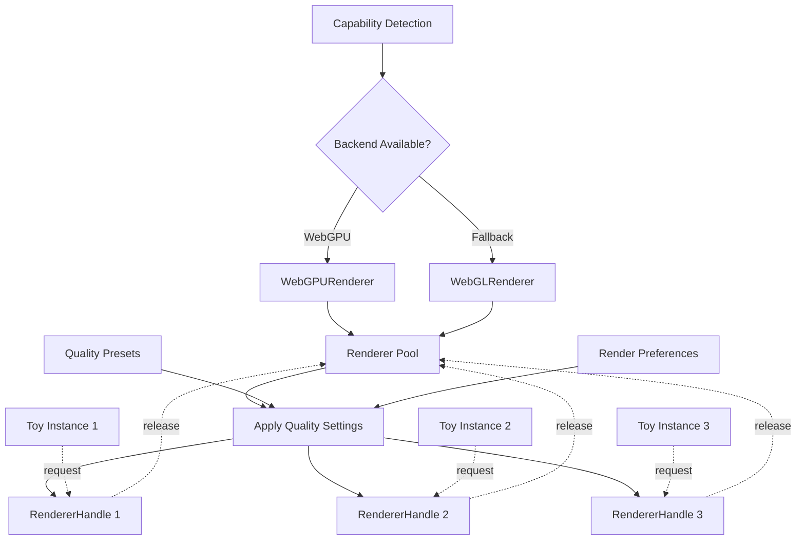
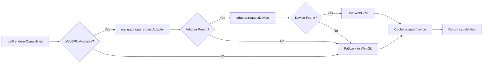

The Stims rendering system provides automatic backend selection (WebGPU or WebGL), renderer pooling, and dynamic quality controls. It ensures optimal performance while minimizing GPU resource allocation.

## Rendering Architecture

The rendering system uses a **pooled renderer** approach where WebGL/WebGPU renderers are initialized once and reused across toys:



## Renderer Handle Interface

The render service provides a `RendererHandle` that includes all resources needed for rendering:

```typescript
export type RendererHandle = {
  renderer: THREE.WebGLRenderer | WebGPURenderer;
  backend: RendererBackend;
  info: RendererInitResult;
  canvas: HTMLCanvasElement;
  applySettings: (
    options?: Partial<RendererInitConfig>,
    viewport?: RendererViewport,
  ) => void;
  release: () => void;
};
```

### RendererHandle Components

<Expandable title="renderer - Three.js Renderer">
  The actual Three.js renderer instance (either `WebGLRenderer` or `WebGPURenderer`). Use this to render your scenes:
  
  ```typescript
  rendererHandle.renderer.render(scene, camera);
  ```
</Expandable>

<Expandable title="backend - Backend Type">
  Indicates which backend is active:
  
  ```typescript
  type RendererBackend = 'webgpu' | 'webgl';
  
  if (rendererHandle.backend === 'webgpu') {
    // Use WebGPU-specific features
  }
  ```
</Expandable>

<Expandable title="info - Renderer Metadata">
  Contains initialization details including:
  - `capabilities`: Feature detection results
  - `maxPixelRatio`: Device pixel ratio cap
  - `renderScale`: Render resolution scale
  - `exposure`: Tone mapping exposure
</Expandable>

<Expandable title="canvas - HTMLCanvasElement">
  The canvas element used for rendering. Automatically attached to the container when the handle is acquired.
</Expandable>

<Expandable title="applySettings() - Update Quality">
  Applies new quality settings without recreating the renderer:
  
  ```typescript
  rendererHandle.applySettings({
    maxPixelRatio: 2,
    renderScale: 0.75,
    exposure: 1.2,
  });
  ```
</Expandable>

<Expandable title="release() - Return to Pool">
  Releases the renderer back to the pool. **Must be called** when the toy is disposed.
</Expandable>

## Requesting a Renderer

Use `requestRenderer()` to get a renderer for your toy:

```typescript
import { requestRenderer } from './services/render-service';
import type { ToyInstance, ToyStartOptions } from './toy-interface';

export async function start(options?: ToyStartOptions): Promise<ToyInstance> {
  const container = options?.container;
  
  // Request a pooled renderer
  const rendererHandle = await requestRenderer({ host: container });
  
  // Set up scene
  const scene = new THREE.Scene();
  const camera = new THREE.PerspectiveCamera();
  
  // Animation loop
  rendererHandle.renderer.setAnimationLoop(() => {
    rendererHandle.renderer.render(scene, camera);
  });
  
  return {
    dispose() {
      // Stop animation
      rendererHandle.renderer.setAnimationLoop(null);
      
      // Clean up scene
      scene.clear();
      
      // Release renderer back to pool
      rendererHandle.release();
    },
  };
}
```

### Request Options

```typescript
await requestRenderer({
  // Container to attach canvas to
  host: document.querySelector('#toy-container'),
  
  // Optional custom canvas
  canvas: existingCanvas,
  
  // Quality overrides
  options: {
    maxPixelRatio: 2,
    renderScale: 0.8,
    exposure: 1.0,
  },
  
  // Custom renderer init (for testing)
  initRendererImpl: customInitRenderer,
});
```

## Capability Detection

The renderer service uses `renderer-capabilities.ts` to detect available graphics backends:

```typescript
export type RendererCapabilities = {
  webGPUAdapter: GPUAdapter | null;
  webGPUDevice: GPUDevice | null;
  preferredBackend: RendererBackend;
  fallbackReason?: string;
  shouldRetryWebGPU?: boolean;
};
```

### Detection Flow



### Fallback Handling

<Warning>
  If WebGPU initialization fails, the system automatically falls back to WebGL and stores the failure reason. The UI can display this reason and offer a retry button.
</Warning>

```typescript
export function rememberRendererFallback(reason: string) {
  if (!cachedCapabilities) {
    cachedCapabilities = {
      webGPUAdapter: null,
      webGPUDevice: null,
      preferredBackend: 'webgl',
      fallbackReason: reason,
      shouldRetryWebGPU: true,
    };
  }
}
```

## Renderer Pooling

The render service maintains a pool of initialized renderers:

```typescript
type RendererPoolEntry = {
  handle: RendererHandle;
  inUse: boolean;
};

const rendererPool: RendererPoolEntry[] = [];
```

### Pool Lifecycle

1. **First request**: Creates a new renderer and adds it to the pool
2. **Subsequent requests**: Reuses an idle renderer from the pool
3. **Settings update**: Applies current quality preset and render preferences
4. **Release**: Marks the renderer as idle, detaches canvas, stops animation loop
5. **Reset**: Optionally disposes all renderers and clears the pool

<Info>
  Pooling avoids expensive WebGPU/WebGL context creation when switching between toys. A typical renderer initialization can take 100-500ms, while reusing a pooled renderer is nearly instant.
</Info>

### Pool Management Functions

```typescript
// Request a renderer (creates or reuses)
await requestRenderer({ host: container });

// Prewarm capabilities before first use
await prewarmRendererCapabilities();

// Reset pool (without disposal)
resetRendererPool({ dispose: false });

// Reset pool and dispose renderers
resetRendererPool({ dispose: true });
```

## Quality Settings

The rendering system supports dynamic quality adjustments through presets and preferences:

```typescript
export type QualityPreset = {
  maxPixelRatio: number;
  renderScale?: number;
  exposure?: number;
};
```

### Quality Preset Examples

| Preset | maxPixelRatio | renderScale | Use Case |
|--------|---------------|-------------|----------|
| **Low** | 1.0 | 0.5 | Mobile devices, battery saving |
| **Medium** | 1.5 | 0.75 | Balanced quality/performance |
| **High** | 2.0 | 1.0 | Desktop, high-end mobile |
| **Ultra** | 3.0 | 1.0 | High-DPI displays, powerful GPUs |

### Settings Application

Quality settings are applied through a resolution chain:

```typescript
function buildSettings(
  options: Partial<RendererInitConfig> = {},
  info?: RendererInitResult | null,
): RendererInitConfig {
  return resolveRendererSettings(
    options,              // Toy-specific overrides
    info,                 // Renderer metadata
    getRenderDefaults(),  // Quality preset + render preferences
  );
}
```

The resolution order (highest priority first):

1. **Toy-specific overrides** - Passed to `applySettings()`
2. **Render preferences** - User settings from UI
3. **Quality presets** - Active preset from settings panel
4. **System defaults** - Fallback values

### Dynamic Settings Updates

The render service subscribes to quality and preference changes:

```typescript
subscribeToQualityPreset((preset) => {
  activeQuality = preset;
  // Apply to all active renderers
  forEachActiveRenderer((entry) => entry.handle.applySettings());
});

subscribeToRenderPreferences((preferences) => {
  activeRenderPreferences = preferences;
  // Apply to all active renderers
  forEachActiveRenderer((entry) => entry.handle.applySettings());
});
```

<Info>
  When quality settings change, all active toys automatically receive the updates without needing to restart.
</Info>

## Renderer Settings

The `applyRendererSettings()` function updates an active renderer:

```typescript
export function applyRendererSettings(
  renderer: THREE.WebGLRenderer | WebGPURenderer,
  info: RendererInitResult,
  options: Partial<RendererInitConfig> = {},
  defaults: Partial<RendererInitConfig> = {},
  viewport?: RendererViewport,
) {
  const settings = resolveRendererSettings(options, info, defaults);
  
  // Apply pixel ratio
  const pixelRatio = Math.min(
    settings.maxPixelRatio,
    window.devicePixelRatio || 1,
  );
  renderer.setPixelRatio(pixelRatio);
  
  // Apply render scale and viewport
  if (viewport) {
    const width = Math.floor(viewport.width * settings.renderScale);
    const height = Math.floor(viewport.height * settings.renderScale);
    renderer.setSize(width, height, false);
  }
  
  // Apply tone mapping (WebGL only)
  if ('toneMapping' in renderer) {
    renderer.toneMappingExposure = settings.exposure;
  }
}
```

## Canvas Management

The render service automatically manages canvas lifecycle:

```typescript
function attachCanvas(canvas: HTMLCanvasElement, host?: HTMLElement) {
  if (!host) return;
  
  if (canvas.parentElement !== host) {
    host.appendChild(canvas);
  }
}

function detachCanvas(canvas: HTMLCanvasElement) {
  if (canvas.parentElement) {
    canvas.parentElement.removeChild(canvas);
  }
}
```

### Canvas Lifecycle

1. **On acquire**: Canvas is attached to the provided host element
2. **On release**: Canvas is detached from the DOM
3. **On next acquire**: Same canvas is reattached to new host

This prevents canvas recreation and preserves GPU contexts.

## Renderer Initialization

The `renderer-setup.ts` module handles low-level renderer creation:

```typescript
export type RendererInitConfig = {
  maxPixelRatio: number;
  renderScale: number;
  exposure: number;
  antialias?: boolean;
  alpha?: boolean;
  powerPreference?: 'high-performance' | 'low-power' | 'default';
};

export async function initRenderer(
  canvas: HTMLCanvasElement,
  config: RendererInitConfig,
): Promise<RendererInitResult | null> {
  const capabilities = await getRendererCapabilities();
  
  if (capabilities.preferredBackend === 'webgpu' && capabilities.webGPUAdapter) {
    return initWebGPURenderer(canvas, config, capabilities);
  }
  
  return initWebGLRenderer(canvas, config);
}
```

### WebGPU Initialization

```typescript
async function initWebGPURenderer(
  canvas: HTMLCanvasElement,
  config: RendererInitConfig,
  capabilities: RendererCapabilities,
): Promise<RendererInitResult> {
  const { webGPUAdapter, webGPUDevice } = capabilities;
  
  const renderer = new WebGPURenderer({
    canvas,
    antialias: config.antialias ?? true,
    alpha: config.alpha ?? false,
    device: webGPUDevice,
  });
  
  await renderer.init();
  
  return {
    renderer,
    backend: 'webgpu',
    capabilities,
    // ... metadata
  };
}
```

### WebGL Initialization

```typescript
function initWebGLRenderer(
  canvas: HTMLCanvasElement,
  config: RendererInitConfig,
): RendererInitResult {
  const renderer = new THREE.WebGLRenderer({
    canvas,
    antialias: config.antialias ?? true,
    alpha: config.alpha ?? false,
    powerPreference: config.powerPreference ?? 'high-performance',
  });
  
  // Apply tone mapping
  renderer.toneMapping = THREE.ACESFilmicToneMapping;
  renderer.toneMappingExposure = config.exposure;
  
  return {
    renderer,
    backend: 'webgl',
    // ... metadata
  };
}
```

## Best Practices

<Info>
  **Always release renderer handles** - Call `rendererHandle.release()` in your toy's `dispose()` method to return the renderer to the pool.
</Info>

<Warning>
  **Don't dispose pooled renderers** - Never call `renderer.dispose()` on a pooled renderer. Use `release()` instead.
</Warning>

### Do's and Don'ts

✅ **Do:**
- Use `requestRenderer()` for standard toys
- Call `release()` in your `dispose()` method
- Use `applySettings()` for toy-specific quality adjustments
- Stop animation loops before releasing
- Respect quality presets from settings panel

❌ **Don't:**
- Call `renderer.dispose()` on pooled renderers
- Manually resize the canvas (use `applySettings()` with viewport)
- Hard-code `devicePixelRatio` (use `maxPixelRatio` setting)
- Request multiple renderers in the same toy
- Forget to release handles on disposal

## Usage Patterns

### Standard Rendering Setup

```typescript
import { requestRenderer } from '../core/services/render-service';
import type { ToyInstance, ToyStartOptions } from '../core/toy-interface';

export async function start(options?: ToyStartOptions): Promise<ToyInstance> {
  const container = options?.container;
  
  // Request renderer
  const rendererHandle = await requestRenderer({ host: container });
  
  // Create scene
  const scene = new THREE.Scene();
  const camera = new THREE.PerspectiveCamera(75, 1, 0.1, 1000);
  
  // Handle resize
  const handleResize = () => {
    const width = container?.clientWidth || window.innerWidth;
    const height = container?.clientHeight || window.innerHeight;
    
    camera.aspect = width / height;
    camera.updateProjectionMatrix();
    
    rendererHandle.applySettings(undefined, { width, height });
  };
  
  window.addEventListener('resize', handleResize);
  handleResize();
  
  // Animation loop
  rendererHandle.renderer.setAnimationLoop(() => {
    rendererHandle.renderer.render(scene, camera);
  });
  
  return {
    dispose() {
      rendererHandle.renderer.setAnimationLoop(null);
      window.removeEventListener('resize', handleResize);
      scene.clear();
      rendererHandle.release();
    },
  };
}
```

### Custom Quality Settings

```typescript
// Request renderer with custom quality
const rendererHandle = await requestRenderer({
  host: container,
  options: {
    maxPixelRatio: 1.5,      // Lower for better performance
    renderScale: 0.8,         // Render at 80% resolution
    exposure: 1.2,            // Brighter tone mapping
  },
});

// Update settings dynamically
rendererHandle.applySettings({
  renderScale: 0.5, // Drop to half resolution
});
```

### Backend-Specific Code

```typescript
const rendererHandle = await requestRenderer({ host: container });

if (rendererHandle.backend === 'webgpu') {
  // Use WebGPU-specific features
  console.log('Running with WebGPU');
} else {
  // WebGL fallback path
  console.log('Running with WebGL');
}
```

## Debugging Rendering Issues

<Expandable title="Black screen / no rendering">
  - Check that `renderer.setAnimationLoop()` is called
  - Verify the canvas is attached to the DOM
  - Ensure camera is positioned correctly
  - Check scene has visible objects
  - Look for WebGL context loss in console
</Expandable>

<Expandable title="Poor performance">
  - Lower `maxPixelRatio` to 1.0 or 1.5
  - Reduce `renderScale` to 0.5 or 0.75
  - Check scene complexity (draw calls, triangles)
  - Profile with Chrome DevTools Performance tab
  - Verify animation loop isn't running multiple times
</Expandable>

<Expandable title="WebGPU not available">
  - Check browser support: Chrome 113+, Edge 113+
  - Verify hardware acceleration is enabled
  - Check `chrome://gpu` for WebGPU status
  - Review `capabilities.fallbackReason` for details
</Expandable>

<Expandable title="Canvas not visible">
  - Verify container has non-zero dimensions
  - Check CSS: canvas should not have `display: none`
  - Ensure `applySettings()` was called with viewport
  - Look for z-index or overflow issues
</Expandable>

## Next Steps

<CardGroup cols={2}>
  <Card title="Architecture Overview" icon="diagram-project" href="/architecture/overview">
    Return to the architecture overview
  </Card>
  <Card title="Toy Lifecycle" icon="rotate" href="/architecture/toy-lifecycle">
    Learn about toy instance management
  </Card>
</CardGroup>