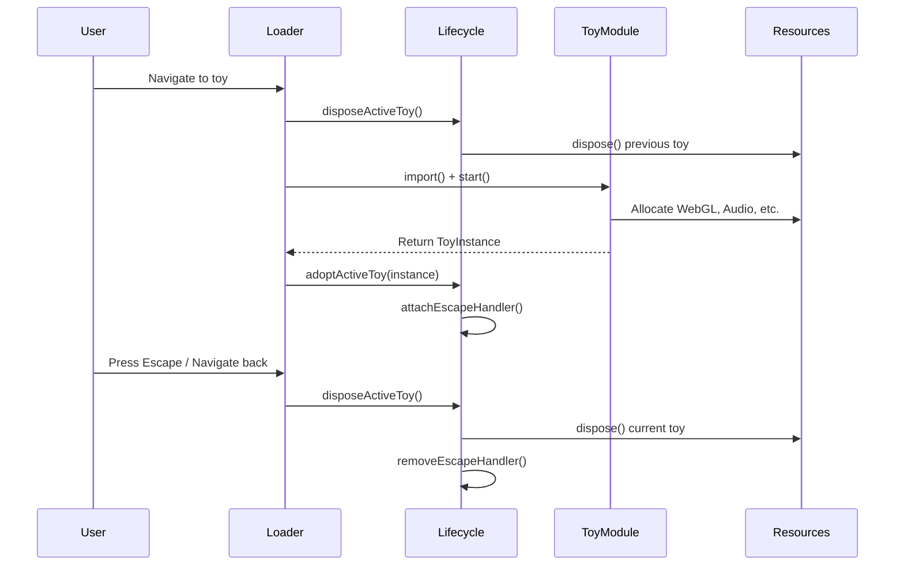

The toy lifecycle system manages the creation, activation, and cleanup of interactive toy instances. It ensures proper resource management and provides consistent patterns for toy developers.

## Toy Instance Interface

Every toy module must return a `ToyInstance` that implements the following interface:

```typescript
export interface ToyInstance {
  /**
   * Cleans up all resources (audio, webgl, event listeners).
   * After calling this, the toy should not be used again.
   */
  dispose(): void;

  /**
   * Optional: Pauses the animation loop and audio processing.
   */
  pause?(): void;

  /**
   * Optional: Resumes the animation loop and audio processing.
   */
  resume?(): void;

  /**
   * Optional: Updates configuration parameters dynamically.
   */
  updateOptions?(options: Record<string, unknown>): void;
}
```

### Required: dispose()

The `dispose()` method is **required** and must clean up all resources including:

- WebGL buffers, geometries, materials, and textures
- Audio streams and analysers
- Event listeners
- Animation loops
- Any other allocated resources

<Warning>
  After `dispose()` is called, the toy instance should not be used again. The loader will create a new instance if the user navigates back to the toy.
</Warning>

### Optional Lifecycle Methods

<Expandable title="pause() - Suspend toy activity">
  Pauses the animation loop and audio processing without fully disposing resources. Useful for temporarily suspending a toy when it's not visible.
</Expandable>

<Expandable title="resume() - Resume toy activity">
  Resumes the animation loop and audio processing after a pause. Should restore the toy to its previous state.
</Expandable>

<Expandable title="updateOptions() - Dynamic configuration">
  Updates toy configuration parameters at runtime. Allows changing toy behavior without restarting it.
</Expandable>

## Toy Start Function

Toy modules export a start function with the following signature:

```typescript
export interface ToyStartOptions {
  /**
   * The container element where the toy should render its canvas and UI.
   * If not provided, the toy may default to a full-screen behavior or throw an error.
   */
  container?: HTMLElement | null;

  /**
   * An optional existing canvas to use. If provided, the toy should respect its size.
   */
  canvas?: HTMLCanvasElement | null;

  /**
   * Optional AudioContext to share across multiple toys or with the main app.
   */
  audioContext?: AudioContext;
}

/**
 * The standard function signature exported by a Toy module.
 */
export type ToyStartFunction = (
  options?: ToyStartOptions,
) => Promise<ToyInstance> | ToyInstance;
```

### Example Toy Implementation

```typescript
import type { ToyInstance, ToyStartOptions } from '../core/toy-interface';

export async function start(options?: ToyStartOptions): Promise<ToyInstance> {
  const container = options?.container;
  const canvas = options?.canvas;
  
  // Initialize your toy resources
  const scene = new THREE.Scene();
  const camera = new THREE.PerspectiveCamera();
  // ... more initialization
  
  return {
    dispose() {
      // Clean up all resources
      scene.clear();
      // ... more cleanup
    },
    pause() {
      // Optional: pause animation
    },
    resume() {
      // Optional: resume animation
    },
  };
}
```

## Lifecycle Management

The `toy-lifecycle.ts` module provides the core lifecycle orchestration:

```typescript
export type ToyLifecycle = {
  getActiveToy: () => ActiveToyRecord;
  adoptActiveToy: (candidate?: unknown) => ActiveToyRecord;
  disposeActiveToy: () => void;
  unregisterActiveToy: (candidate?: unknown) => void;
  attachEscapeHandler: (onBack?: () => void) => void;
  removeEscapeHandler: () => void;
  reset: () => void;
};
```

### Lifecycle Phases

The loader follows a structured sequence when loading and unloading toys:



## Loader Lifecycle Steps

The loader (`assets/js/loader.ts`) orchestrates the full toy lifecycle:

### 1. Resolve Toy

Look up the slug in `assets/data/toys.json` and ensure rendering support. Renderer capabilities and microphone permission checks are prewarmed so subsequent toy loads skip redundant probes/prompts.

### 2. Navigate

Push state with the router when requested, set up Escape-to-library, and clear any previous toy.

### 3. Render Shell

Ask `toy-view` to show the active toy container and loading indicator. Bubble capability status to the UI.

### 4. Import Module

Resolve a Vite-friendly URL via the manifest client and `import()` it.

### 5. Start Toy

Call the module's `start` or default export. Normalize the returned reference so `dispose` can be called on navigation.

```typescript
const toyModule = await import(toyUrl);
const startFn = toyModule.start || toyModule.default;
const instance = await startFn({ container, canvas });
lifecycle.adoptActiveToy(instance);
```

### 6. Cleanup

On Escape/back, dispose the active toy, clear the container, and reset renderer status in the view.

```typescript
lifecycle.disposeActiveToy();
view.clearContainer();
view.resetRendererStatus();
```

## Active Toy Normalization

The lifecycle manager normalizes different return types from toy modules:

```typescript
type ActiveToyObject = { dispose?: () => void };
export type ActiveToyCandidate = ActiveToyObject | (() => void);

function normalizeActiveToy(candidate: unknown): ActiveToyRecord {
  if (!candidate) return null;

  if (!isActiveToyCandidate(candidate)) return null;

  // If it's just a function, treat it as the dispose function
  if (typeof candidate === 'function') {
    return { ref: candidate, dispose: candidate };
  }

  // If it's an object, extract the dispose method
  const dispose = candidate.dispose;
  return {
    ref: candidate,
    dispose: dispose ? dispose.bind(candidate) : undefined,
  };
}
```

This allows toys to return:

1. A full `ToyInstance` object with `dispose()` method
2. Just a cleanup function
3. Any object with a `dispose()` method

## Escape Key Handling

The lifecycle manager attaches a global Escape key handler when a toy is active:

```typescript
attachEscapeHandler: (onBack?: () => void) => {
  const win = getWindow();
  if (!win) return;

  escapeHandler = (event: KeyboardEvent) => {
    if (event.key === 'Escape') {
      event.preventDefault();
      onBack();
    }
  };

  win.addEventListener('keydown', escapeHandler);
}
```

This ensures users can always press Escape to return to the library, even if a toy has issues.

## Lifecycle Responsibilities

| Phase | Owner | Notes |
|-------|-------|-------|
| Navigation | `router.ts` | Syncs query params and back/forward navigation |
| UI scaffolding | `toy-view.ts` | Shows loader, active toy shell, and status badges |
| Module load | `loader.ts` + `manifest-client.ts` | Resolves module URLs for both dev and build |
| Runtime init | `web-toy.ts` | Builds scene, camera, renderer, and audio loop wiring |
| Cleanup | `web-toy.ts` + toy `dispose` | Releases pooled resources and removes canvas/audio refs |

## Best Practices

<Info>
  **Always implement dispose()** - This is the most critical lifecycle method. Failing to clean up resources leads to memory leaks.
</Info>

<Warning>
  **Don't swallow import errors** - Throw or log during init so the loader's import error UI can respond. Avoid swallowing dynamic import failures silently.
</Warning>

### Resource Cleanup Checklist

When implementing `dispose()`, ensure you:

- [ ] Stop animation loops (`renderer.setAnimationLoop(null)`)
- [ ] Dispose Three.js objects (geometries, materials, textures)
- [ ] Release audio handles (`audioHandle.release()`)
- [ ] Release renderer handles (`rendererHandle.release()`)
- [ ] Remove event listeners
- [ ] Clear timers and intervals
- [ ] Remove DOM elements created by the toy

### Example Complete Disposal

```typescript
dispose() {
  // Stop animation
  rendererHandle.renderer.setAnimationLoop(null);
  
  // Dispose Three.js resources
  scene.traverse((object) => {
    if (object instanceof THREE.Mesh) {
      object.geometry.dispose();
      if (Array.isArray(object.material)) {
        object.material.forEach(mat => mat.dispose());
      } else {
        object.material.dispose();
      }
    }
  });
  
  // Release pooled resources
  audioHandle?.release();
  rendererHandle?.release();
  
  // Remove event listeners
  window.removeEventListener('resize', handleResize);
  
  // Clear scene
  scene.clear();
}
```

## Next Steps

<CardGroup cols={2}>
  <Card title="Audio System" icon="microphone" href="/architecture/audio-system">
    Learn about audio pooling and microphone management
  </Card>
  <Card title="Rendering" icon="brush" href="/architecture/rendering">
    Understand renderer pooling and quality settings
  </Card>
</CardGroup>